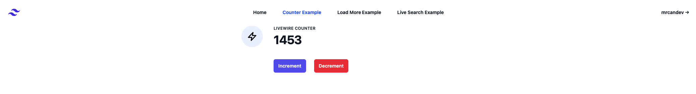
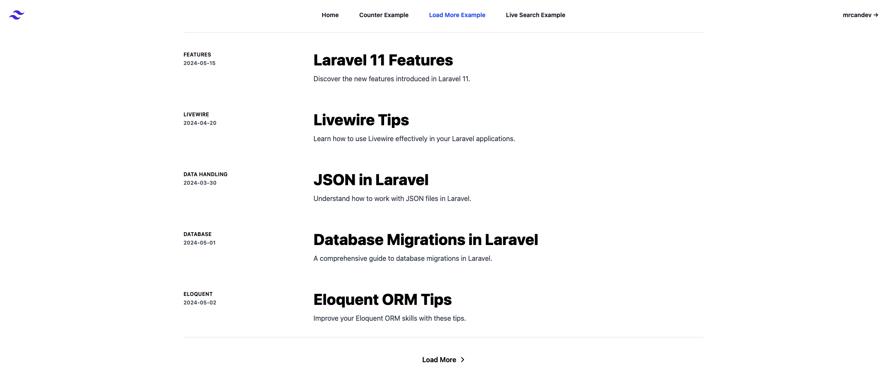
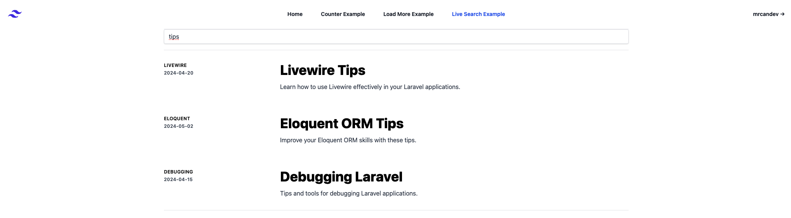

# Laravel and Livewire Examples

This repository contains examples of using Laravel 11 with Livewire. It provides several use cases demonstrating how to integrate Livewire components into a Laravel application.

## Screenshots






## Table of Contents
- [Prerequisites](#prerequisites)
- [Installation](#installation)
- [Usage](#usage)
- [Contributing](#contributing)
- [License](#license)

## Prerequisites
Before you begin, ensure you have met the following requirements:
- PHP >= 8.2
- Composer installed globally
- Node.js and npm installed

## Installation
To install and set up the project locally, follow these steps:

1. Clone the repository:
   ```bash
   git clone https://github.com/your-username/laravel-livewire-examples.git

2. Navigate to the project directory:
    ```bash
    cd laravel-livewire-examples

3. Install PHP dependencies:
    ```bash
    composer install

4. Install JavaScript dependencies:
    ```bash
    npm install

5. Compile assets:
    ```bash
    npm run dev

6. Set up your environment variables:
    ```bash
    cp .env.example .env
    php artisan key:generate

7. Run migrations (optional):
    ```bash
    php artisan migrate

   
## Usage
To install and set up the project locally, follow these steps:
1. To run the application, use the following command:
    ```bash
    php artisan migrate

Visit http://localhost:8000 in your web browser to view the application.


## Contributing
Contributions are welcome! Here's how you can contribute to this project:

1. Fork the repository.
2. Create a new branch (git checkout -b feature/your-feature-name).
3. Commit your changes (git commit -am 'Add some feature').
4. Push to the branch (git push origin feature/your-feature-name).
5. Create a new Pull Request.

## Supporting
If you find this project useful and would like to support its development, you can:
- **Star the repository**: If you find this project helpful or interesting, please give it a star.
- **Fork and contribute**: Contributions are welcome! Feel free to fork this project and submit pull requests.
- **Donate**: If you'd like to make a monetary donation to support the developer, you can use the sponsor button on GitHub or visit the developer's profile for more options.

## License
This project is licensed under the [MIT license](https://opensource.org/licenses/MIT).
.
